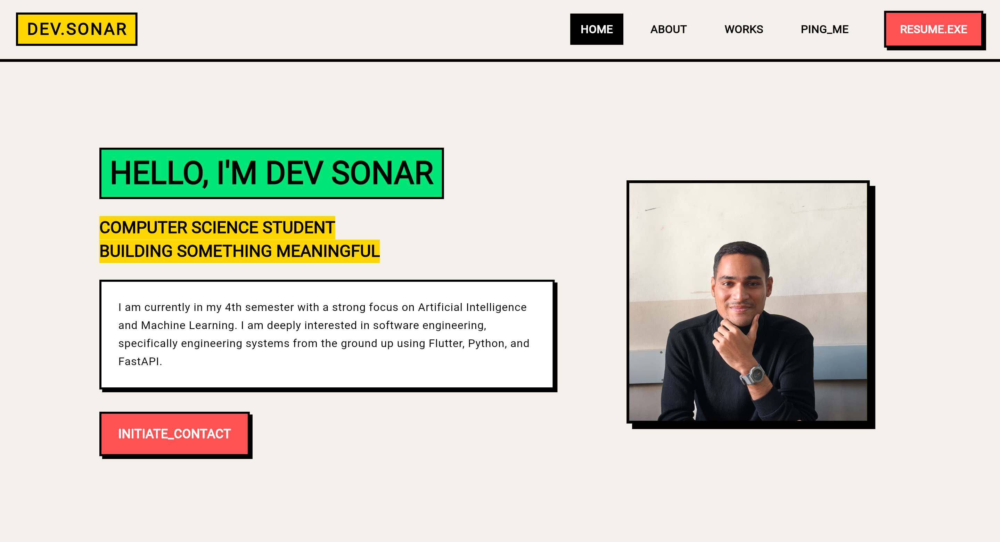

# Dev Sonar - Portfolio Website

Welcome to my portfolio website! This project is built using Flutter and features a unique **Neo-Brutalism** design style.

## 📸 Preview

Check it Out : https://myportfolio-six-smoky.vercel.app/

## 🎨 Neo-Brutalism Implementation

This portfolio embraces the **Neo-Brutalism** (or Neu-Brutalism) aesthetic, which breaks away from traditional soft UI trends by using bold, raw, and high-contrast elements.

### Key Design Pillars:

*   **Bold Typography**: I've used **Courier** as the primary font to give it a technical, monospace look reminiscent of terminal interfaces.
*   **High Contrast Colors**: A vibrant palette featuring:
    *   **Vibrant Red/Pink** (`#FF5252`) for primary actions.
    *   **Neon Green** (`#00E676`) for secondary highlights.
    *   **Cyber Yellow** (`#FFD600`) for navigation elements.
    *   A warm, off-white background (`#F4F0EA`) to make the colors pop.
*   **Hard Shadows & Thick Borders**: Unlike standard Material Design, all containers (buttons, cards, navbars) feature **thick black borders (3px - 4px)** and **harsh, unblurred shadows** (offset but with 0 blur radius).
*   **Raw Layouts**: The UI uses sharp corners and structured layouts that emphasize the "brutalist" nature of the design.

## 🛠️ Tech Stack

*   **Framework**: Flutter (Web)
*   **State Management**: StatefulWidget (Keeping it simple and effective)
*   **Navigation**: Custom navigation with `AnimatedSwitcher` for smooth transitions.